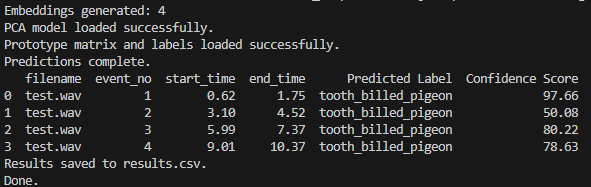

# Bird Call Detection and Classification

This repository provides a pipeline to detect, segment, and classify bird calls from an audio file. It uses machine learning models to process audio data, generate embeddings, and classify bird calls, producing a `results.csv` file with detailed information for each detected event.

## How to Run

### Steps:

1. **Clone the Repository**

```bash
   git clone https://github.com/colossal-compsci/few-shot-bird-call.git
   cd few-shot-bird-call
```

2. **Create a Conda Environment**

After cloning the repository, create a new conda environment named birdcall with Python 3.11:

```bash
conda create -n birdcall python=3.11 -y
```
Activate the environment:

```bash
conda activate birdcall
```

3. **Install the Requirements**
Install the required dependencies listed in requirements.txt:
```bash
pip install -r requirements.txt
```

4. **Run the Main Script**
Run the main script to start the detection and classification process. This will analyze test.wav (located in the data folder) and generate a results.csv file with the detection results.
```bash
python main.py
```
## Output

The `results.csv` file contains the following columns for each detected event:

- **filename**: Name of the input audio file.
- **event_no**: Sequential number for each detected event.
- **start_time**: Start time of the event in seconds.
- **end_time**: End time of the event in seconds.
- **Predicted Label**: The predicted bird species label.
- **Confidence Score**: Confidence score for the prediction.

### Example Output

The generated `results.csv` might look like this for the test file `test.wav`:

| filename   | event_no | start_time | end_time | Predicted Label       | Confidence Score |
|------------|----------|------------|----------|-----------------------|------------------|
| test.wav   | 1        | 0.62       | 1.75     | tooth_billed_pigeon   | 97.66           |
| test.wav   | 2        | 3.10       | 4.52     | tooth_billed_pigeon   | 50.08           |
| test.wav   | 3        | 5.99       | 7.37     | tooth_billed_pigeon   | 80.22           |
| test.wav   | 4        | 9.01       | 10.37    | tooth_billed_pigeon   | 78.63           |

### Sample Output Image

Below is an example output image showing the structure of `results.csv`:



This `results.csv` file contains all detected events with details on the time intervals, predicted bird species, and confidence scores.